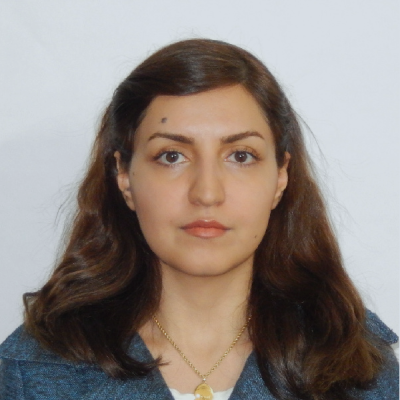

<html lang="en">
<head>
  <link rel="stylesheet" href="CSS/app.css">
  
  
  
  
  
</head>
<body>
   <h1 class="p1" style="font-size:30px"><b>Maedeh Haghanimanesh Resume</b></h1>
  
 
 <h1 class="p1" style="font-size:25px"><b>Personal informations:</b></h1>
  
- name: Maedeh

  
- last name : Haghanimanesh

  
- Date of birth : 1986/June/18

  
- location : Esfahan , I.R.Iran

  ------------------------------------------------------------
  ------------------------------------------------------------
  <h1 class="p1" style="font-size:25px"><b>Education:</b></h1>
    <h1 class="p1" style="font-size:15px"><b>Master of Science, Mechanical Engineering-Energy Conversion(2018-2021)</b></h1>
  
- University of Isfahan

  
- Thesis title: Exergy-Economic and Exergy-Environmental analysis of heat recovery processes from the annealing process of cold rolled steel coils.

  
- Supervisor: Dr. Ehsan Baniasadi

  
- GPA: 18.11/20

  
  </body>
</html>

                       
  - ### [<button class="button button1">ABS3</button>](resume-fa.md)                     
                       
         
   <html lang="en">
<head>
  <link rel="stylesheet" href="CSS/app.css">
  
  
  
  
  
</head>
<body>          
  <h1 class="p1" style="font-size:15px"><b>Bachelor of Science, Mechanical Engineering-Thermo-Fluid Design(2005-2009)</b></h1>
    
- University of Kashan

    
- Thesis title: Investigation of new cooling and heating methods: Clean room, pool, plane and stadium

    
- Supervisor: Dr. Ghanbar Ali Sheikhzadeh

   ------------------------------------------------------------
   ------------------------------------------------------------
  <h1 class="p1" style="font-size:25px"><b>Publications:</b></h1>
  
<b>1.</b> Javad Karimi Kerdabadi, <b>Maedeh Haghanimanesh</b>, Arash Karimipour, Davood Toghraie, and Iskander Tlili. "The experimental/numerical investigation of variations in strip speed, water shower pattern and water temperature on high-temperature strip cooling rate in hot strip mill." Journal of Thermal Analysis and Calorimetry (2020): 1-16. DOI: https://doi.org/10.1007/s10973-019-09052-4

  
  
<b>2. Maedeh Haghanimanesh</b>, Ehsan Baniasadi, Javad Karimi Kerdabadi. "4E Analysis of the Triple Generation Cycle Using Heat Dissipation Furnace Slag and Biogas Unit." To be submitted. (This article related to the project of advanced thermodynamic course)

  
  
<b>3. Maedeh Haghanimanesh</b>, Masoud Ziaei-Rad, Ehsan Baniasadi. "Two-dimensional modeling and comparison of turbulence flow modeling methods in a two-stage ejector in the refrigeration cycle." In preparation. (This article related to the project of Turbulence course)

  
  
<b>4. Maedeh Haghanimanesh</b>, Ehsan Baniasadi. "Thermal Modeling of Heating, Cooling and Solar Power of a Zero Energy Building with TRNSYS and TRNBUILD Software." In preparation. (This article related to the project of Advanced solar energy course)
  
  
    
<b>5. Maedeh Haghanimanesh, Ehsan Baniasadi. "4E analyses of heat recovery processes from the annealing process of cold rolled steel coils." To be submitted. (This article related to the master of science thesis course)
  
             
</body>
</html>

