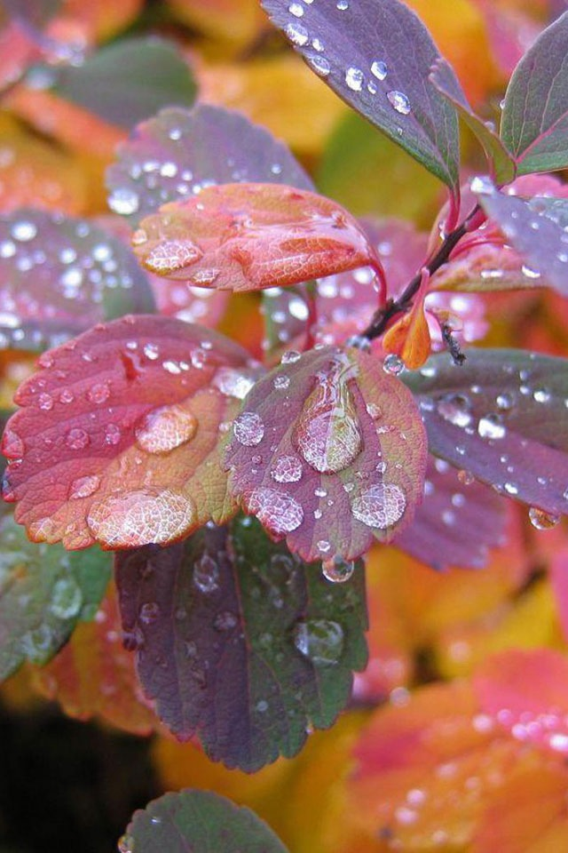

<html lang="en">
<head>
  <link rel="stylesheet" href="CSS/app.css">
  
</head>
<body>
  
<h1>Maedeh Haghanimanesh</h1>

This is a paragraph.

  
 <h1>The button Element</h1>

<button type="button" onclick="(resume-fa.md)">Click Me!</button>
  <button class="button button1">Green</button>
<button class="button button2">Blue</button>
  
  

    <a href="(resume-fa.md)">Visit W3Schools.com!</a>
  

</body>
</html>

### Personal informations

---
+ name: Maedeh
- ### [<button class="button button1">ABS3</button>](resume-fa.md)
+ last name : Haghanimanesh
+ Date of birth : 1986/June/18
+ location : Esfahan , I.R.Iran
+ ### [<button type="button" onclick="(resume-fa.md)">Abstract2!</button>](resume-fa.md)

### [Abstract](resume-fa.md)

